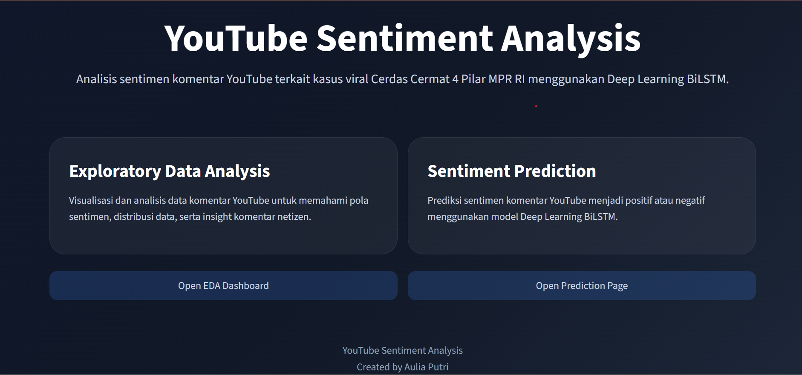

# 🧠 NLP Sentiment Analysis: Binary Text Classification Using Artificial Neural Network (ANN)

<p align="center">
  
</p>

<p align="center">
  End-to-End Natural Language Processing Project for Indonesian YouTube Comment Sentiment Classification
</p>

---


---

# 📌 Project Overview

This project implements an **End-to-End Natural Language Processing (NLP) pipeline** to classify Indonesian YouTube comments into two sentiment categories using an **Artificial Neural Network (ANN)**.

The objective is to transform unstructured user-generated text into meaningful sentiment insights through:

* Text preprocessing
* Feature transformation
* Deep learning model development
* Model evaluation
* Model inference
* Application deployment

The model analyzes public reactions from YouTube discussions related to the viral **"Cerdas Cermat 4 Pilar MPR RI"** event by automatically classifying comments into:

| Class    | Description                                                                                         |
| -------- | --------------------------------------------------------------------------------------------------- |
| Negative | Comments containing criticism, disappointment, disagreement, dissatisfaction, or negative reactions |
| Positive | Comments showing support, encouragement, agreement, or neutral expressions                          |

---

# 🎯 Project Objectives

The main objectives of this project are:

| Objective                                      | Implementation                        |
| ---------------------------------------------- | ------------------------------------- |
| Build an NLP sentiment classification pipeline | Text preprocessing and transformation |
| Develop a deep learning classification model   | Artificial Neural Network (ANN)       |
| Evaluate model performance                     | Accuracy, Precision, Recall, F1-score |
| Create reusable inference workflow             | Saved model and tokenizer             |
| Deploy machine learning application            | Streamlit deployment                  |

---

# 📂 Dataset

## Dataset Source

The dataset was collected from Indonesian YouTube comments using web scraping techniques.

| Attribute  | Description                     |
| ---------- | ------------------------------- |
| Source     | YouTube Comments                |
| Language   | Indonesian                      |
| Data Type  | User-generated text             |
| Task       | Binary Sentiment Classification |
| Total Data | 1,272 comments                  |
| File       | `youtube_comments.csv`          |

Dataset features:

```
username
comment
likes
time
```

---

# 🔎 Exploratory Data Analysis (EDA)

Exploratory Data Analysis was performed to understand:

* Dataset distribution
* Missing values
* Duplicate data
* Comment length distribution
* Word frequency
* Sentiment distribution

EDA helps identify data characteristics and ensure data quality before model training.

---

# 🧹 NLP Preprocessing Pipeline

Raw text cannot directly be processed by neural networks. Therefore, several preprocessing steps were applied:

```
Raw Comments

      ↓

Case Folding

      ↓

Text Cleaning

      ↓

Noise Removal

      ↓

Tokenization

      ↓

Sequence Padding

      ↓

Model Input
```

Preprocessing techniques:

* Lowercase conversion
* Removing punctuation
* Removing unnecessary characters
* Text normalization
* Tokenization
* Sequence padding

---

# 🧠 Model Development

## Artificial Neural Network (ANN)

The project uses an Artificial Neural Network architecture for binary sentiment classification.

Model workflow:

```
Input Text

      ↓

Tokenizer

      ↓

Embedding Representation

      ↓

Dense Neural Network

      ↓

Dropout Layer

      ↓

Sigmoid Output

      ↓

Sentiment Prediction
```

Prediction output:

```
0 → Negative Sentiment

1 → Positive Sentiment
```

---

# 📊 Training Performance

The model training process was monitored using training and validation metrics to evaluate learning behavior and generalization capability.

| Metric              |  Score |
| ------------------- | -----: |
| Training Accuracy   | 97.14% |
| Validation Accuracy | 88.14% |
| Training Loss       | 0.1464 |
| Validation Loss     | 0.3235 |

## Training Analysis

The model achieved high performance on training data while maintaining stable validation performance.

The difference between training and validation accuracy indicates a slight overfitting tendency. However, the validation accuracy shows that the model is still able to generalize well to unseen data.

---

# 📈 Model Evaluation

The final model was evaluated using the test dataset with classification metrics:

| Metric                | Score |
| --------------------- | ----: |
| Accuracy              |   87% |
| Precision (Macro Avg) |   85% |
| Recall (Macro Avg)    |   87% |
| F1-Score (Macro Avg)  |   86% |
| Weighted F1-Score     |   88% |

## Classification Report

| Class        | Precision | Recall | F1-Score | Support |
| ------------ | --------: | -----: | -------: | ------: |
| Negative (0) |      0.92 |   0.89 |     0.90 |      80 |
| Positive (1) |      0.79 |   0.85 |     0.81 |      39 |

## Performance Analysis

The model achieved **87% accuracy** on unseen test data.

The **macro F1-score of 0.86** indicates balanced performance between negative and positive sentiment classes.

The model performs slightly better in detecting negative sentiment, which aligns with the dominant public reaction pattern within the analyzed dataset.

---

# 📊 Model Visualization

## Confusion Matrix


## Training History


---

# 💾 Model Artifact

The trained model and supporting files are stored for inference:

```
models/

├── best_sentiment_model.keras

├── best_sentiment_model.h5

└── tokenizer.pkl
```

These artifacts allow prediction on new unseen comments without retraining the model.

---

# 🚀 Deployment

The final model has been deployed as an interactive Streamlit application.

Application workflow:

```
User Input Comment

        ↓

Text Preprocessing

        ↓

Tokenizer Transformation

        ↓

ANN Model Prediction

        ↓

Sentiment Classification Result
```

## Live Application

🔗 Hugging Face Spaces:

https://huggingface.co/spaces/Awliaputri/Analisis_Sentimen

---

# 🛠️ Technology Stack

## Programming Language

* Python

## Data Processing

* Pandas
* NumPy

## Machine Learning & Deep Learning

* TensorFlow
* Keras
* Scikit-learn

## Natural Language Processing

* Text Cleaning
* Tokenization
* Sequence Padding
* Text Representation

## Visualization

* Matplotlib
* Seaborn

## Deployment

* Streamlit
* Docker

---

# 📁 Project Structure

```
Analisis_Sentimen/

│
├── assets/
│   ├── streamlit_demo.png
│   ├── confusion_matrix.png
│   └── training_history.png
│
├── datasets/
│   ├── dataset_clean.csv
│   ├── youtube_comments.csv
│   └── kamuskatabaku.xlsx
│
├── models/
│   ├── best_sentiment_model.keras
│   ├── best_sentiment_model.h5
│   └── tokenizer.pkl
│
├── notebooks/
│   ├── data_scraping.ipynb
│   ├── model_training.ipynb
│   └── model_inference.ipynb
│
└── README.md
```

---

# ⚙️ Installation & Usage

## Clone Repository

```bash
git clone https://github.com/username/Analisis_Sentimen.git

cd Analisis_Sentimen
```

## Install Dependencies

```bash
pip install -r requirements.txt
```

## Run Application

```bash
streamlit run src/streamlit_app.py
```

---

# 🔮 Future Improvements

Potential improvements for future development:

* Increase dataset size for better generalization
* Perform hyperparameter tuning
* Apply pretrained language models such as IndoBERT
* Implement real-time sentiment monitoring dashboard
* Improve deployment scalability using API architecture

---

# 📌 Key Skills Demonstrated

## Data Science

✔ Exploratory Data Analysis
✔ Data Cleaning
✔ Feature Engineering
✔ Model Evaluation

## Natural Language Processing

✔ Text Classification
✔ Text Preprocessing
✔ Tokenization
✔ Sentiment Analysis

## Deep Learning

✔ Artificial Neural Network
✔ Model Training
✔ Model Optimization
✔ Model Inference

## Deployment

✔ Streamlit Application
✔ Docker Containerization
✔ Machine Learning Deployment Workflow

---

# 👩‍💻 Author

## Aulia Putri

Computer Science Graduate | Data Science & Machine Learning Enthusiast

Focus Areas:

* Data Science
* Machine Learning
* Artificial Intelligence
* Natural Language Processing
* Data Analytics
